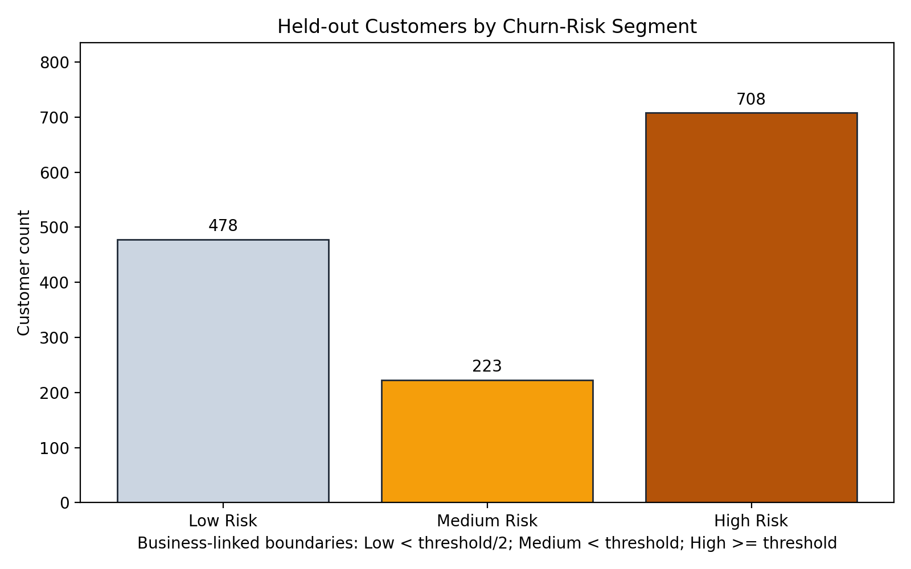
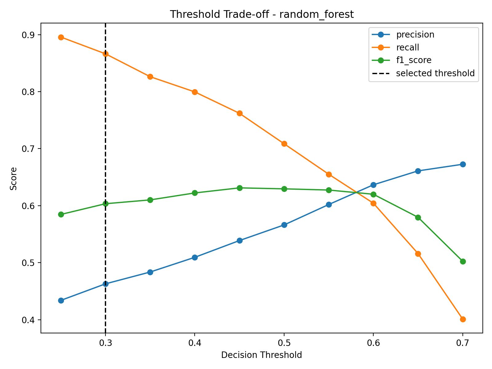
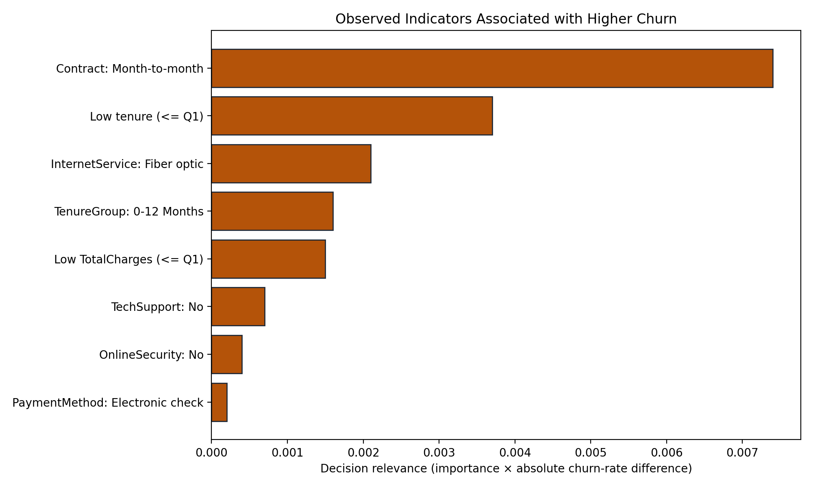
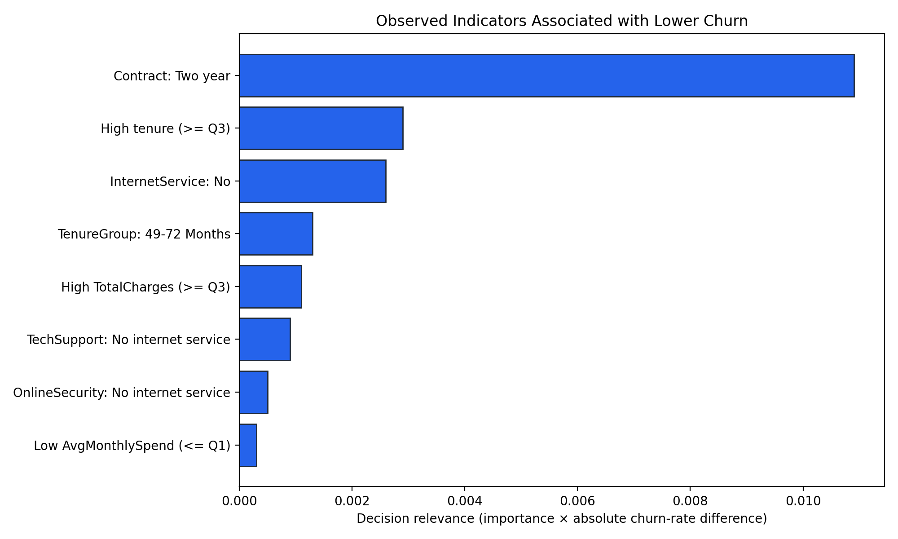

# Customer Retention Intelligence

## From Churn Probability to Retention Priority

Predicting churn is not enough for a retention team. The team also needs to know which customers
should be reviewed first, how urgent their risk is, which observable indicators are present, and
which intervention is reasonable to test.

This project transforms telecom customer data into **churn probabilities**, a validated decision
threshold, risk segments, retention priorities, observed risk indicators, and Power BI-ready
decision outputs. Suggested actions are testable hypotheses, not claims that an intervention has
already been proven to prevent churn.

## The Retention Decision

The project supports one practical decision:

> Which customers should be prioritized for retention outreach when contact capacity is limited?

The modeling objective is to identify a high proportion of actual churners while keeping outreach
operationally manageable. False negatives represent churners the workflow misses, so recall is an
important consideration. Precision remains a guardrail against spending retention resources on
too many customers who would otherwise stay.

## How a Customer Becomes a Retention Priority

```text
Customer profile
      ->
Churn probability
      ->
Validated decision threshold
      ->
Low / Medium / High Risk
      ->
Transparent priority score
      ->
Observed risk indicators
      ->
Suggested intervention hypothesis
      ->
Power BI retention queue
```

`customerID` is retained as a traceability key in decision outputs, but it is explicitly excluded
from model features together with `Churn` and `ChurnFlag`.

## Retention Snapshot

The source dataset contains 7,043 customers with a historical churn rate of 26.54%. Final
evaluation uses 1,409 customers in a held-out test set that is not used for model or threshold
selection.

| Measure | Verified result |
|---|---:|
| Selected model | Random Forest |
| Selected threshold | 0.30 |
| Churn recall | 86.90% |
| Churn precision | 45.90% |
| Churn F1 | 60.07% |
| PR-AUC | 64.70% |
| ROC-AUC | 84.07% |
| Churners detected | 325 |
| Churners missed | 49 |
| High Risk customers | 708 |
| Priority 1 customers | 220 |

Complete results for all evaluated models are available in
[`reports/metrics/model_comparison.csv`](reports/metrics/model_comparison.csv).

## Customer Risk Portfolio

Risk segments are anchored directly to the intervention threshold:

- **Low Risk:** probability `< 0.15`
- **Medium Risk:** probability `0.15 to < 0.30`
- **High Risk:** probability `>= 0.30`

| Risk segment | Customers | Portfolio share | Average probability | Actual churn rate |
|---|---:|---:|---:|---:|
| Low Risk | 478 | 33.92% | 5.64% | 3.14% |
| Medium Risk | 223 | 15.83% | 21.52% | 15.25% |
| High Risk | 708 | 50.25% | 61.85% | 45.90% |



Probability quantiles are evaluated as an alternative. Both methods produce monotonic risk
separation, but business-linked boundaries are selected because High Risk remains identical to
the population crossing the intervention threshold. The full comparison is documented in
[`reports/insights/risk_segmentation_method.md`](reports/insights/risk_segmentation_method.md).

## The Decision Threshold

The threshold is not optimized on the test set. The pipeline creates a validation subset from the
training data, compares thresholds from `0.25` through `0.70` for five models, and evaluates a
documented combination of:

- churn recall: 30%;
- churn F1: 30%;
- PR-AUC: 25%;
- churn precision: 15%.

Candidates must also reach at least 45% precision and flag no more than 50% of validation
customers. This process selects Random Forest at threshold `0.30`. The model is then refit on the
complete training set and evaluated once on the held-out test set.



Threshold `0.30` prioritizes churner coverage. Its cost is 383 false positives: customers who do
not churn but enter the outreach population. The 49 false negatives are actual churners who are
not detected and therefore do not enter threshold-based intervention.

## Retention Action Queue

The priority score is not produced by another opaque model:

```text
Priority score = 60% churn probability
               + 25% customer-value proxy
               + 15% intervention urgency
```

The customer-value proxy combines `MonthlyCharges` and `TotalCharges`, scaled against their 95th
percentiles in the training data. It is **not Customer Lifetime Value**. Urgency uses tenure and
month-to-month contract status.

| Priority | Rule | Customers |
|---|---|---:|
| Priority 1 | High Risk and priority score >= 70 | 220 |
| Priority 2 | Other High Risk customers | 488 |
| Priority 3 | Medium Risk | 223 |
| Monitor | Low Risk | 478 |

The following anonymized examples come from the generated queue:

| Customer | Churn probability | Risk | Priority score | Priority | Suggested action | Primary observed indicator |
|---|---:|---|---:|---|---|---|
| Customer A | 95.68% | High Risk | 85.76 | Priority 1 | Contract-upgrade incentive | Tenure <= 12 months |
| Customer B | 93.94% | High Risk | 85.74 | Priority 1 | Contract-upgrade incentive | Tenure <= 12 months |
| Customer C | 95.50% | High Risk | 85.60 | Priority 1 | Contract-upgrade incentive | Tenure <= 12 months |

The full decision queue is available in
[`powerbi/customer_retention_queue.csv`](powerbi/customer_retention_queue.csv).

## What Raises the Risk Signal

Global driver analysis combines model permutation importance with historical churn associations.
The output separates indicators associated with higher churn from retention indicators. These
results do not establish causality.



Customer-level indicators are retained only when they cover at least 100 customers and have an
observed churn rate at least five percentage points above the overall churn rate. Examples include
short tenure, electronic-check payment, month-to-month contracts, fiber-optic service, and the
absence of technical support or online security.



Because exact local model explanations are not used, customer-level outputs are labeled
**Observed risk indicators**, not "reasons the model predicted churn."

## Retention Actions

Action rules connect risk segments and customer characteristics to intervention hypotheses:

- contract-upgrade incentive;
- onboarding-support outreach;
- technical-support outreach;
- payment-method assistance;
- retention call;
- targeted retention email;
- monitor only.

Each action includes an expected mechanism and a suggested success metric. Effectiveness is not
established because the dataset contains no experiment or intervention outcomes. Complete rules
and supporting evidence are available in
[`reports/insights/retention_recommendations.md`](reports/insights/retention_recommendations.md).

## Hypothetical Strategy Simulation

The simulation compares targeting strategies under explicitly hypothetical assumptions: outreach
cost `5`, incentive cost `20`, remaining-churn cost `300`, and intervention success rate `25%`.
All amounts are **hypothetical value units**, not real telecom costs or revenue.

| Strategy | Contacted | Churners captured | Churners missed | False-positive interventions | Hypothetical net value |
|---|---:|---:|---:|---:|---:|
| No intervention | 0 | 0 | 374 | 0 | 0 |
| Contact all customers | 1,409 | 374 | 0 | 1,035 | -7,175 |
| Default threshold 0.50 | 498 | 272 | 102 | 226 | 7,950 |
| Selected threshold 0.30 | 708 | 325 | 49 | 383 | 6,675 |
| Priority 1 only | 220 | 149 | 225 | 71 | 5,675 |

Under these assumptions, threshold `0.50` produces the highest hypothetical net value, while
threshold `0.30` captures more churners. Model-selection objectives and economic strategy are not
the same decision. The ranking can change when costs, customer value, capacity, or intervention
success rates change.

## Power BI Decision Layer

The pipeline generates:

- `customer_retention_queue.csv` for customer-level action;
- `risk_segment_summary.csv` for the risk portfolio;
- `model_performance_summary.csv` for model evidence;
- `churn_driver_summary.csv` for churn and retention indicators;
- summaries by contract, payment method, and internet service.

The recommended Power BI design has four pages:

1. Executive Retention Overview
2. Customer Risk Portfolio
3. Churn Drivers
4. Retention Action Queue

Grains and column definitions are documented in
[`powerbi/DATA_DICTIONARY.md`](powerbi/DATA_DICTIONARY.md), while the dashboard design is available
in [`powerbi/DASHBOARD_GUIDE.md`](powerbi/DASHBOARD_GUIDE.md). This repository does not claim that
a `.pbix` dashboard exists.

## Where the System Can Be Wrong

- False negatives leave actual churners outside threshold-based outreach.
- False positives create unnecessary outreach and incentive costs.
- Probabilities are not separately calibrated; scores are used primarily for ranking and thresholding.
- Risk and priority boundaries are transparent decision rules, not universal cutoffs.
- Historical associations and feature importance do not establish causality.
- The customer-level queue uses the holdout test set to keep the decision example out-of-sample.
  Other historical summaries may use the complete dataset and must not be added to the same population KPI.

Error records and their concentration are documented in
[`reports/insights/error_analysis_summary.md`](reports/insights/error_analysis_summary.md).

## Reproducing the Decision Pipeline

```bash
pip install -r requirements.txt
python run_pipeline.py
python -m pytest -q
```

The pipeline validates the schema, cleans the data, engineers features, trains five models,
selects a model and threshold on validation data, evaluates the holdout set, and generates model
artifacts, insights, figures, a retention queue, and Power BI datasets.

Dataset: [Telco Customer Churn](https://www.kaggle.com/datasets/blastchar/telco-customer-churn).
The pipeline reuses a local copy when available and uses KaggleHub as a fallback.

## Repository Structure

```text
data/                  # raw and generated processed data
models/                # complete pipelines and model metadata
notebooks/             # secondary walkthrough
powerbi/               # decision datasets, dictionary, and dashboard guide
reports/
|-- figures/           # evaluation and decision visuals
|-- insights/          # risk, priority, actions, drivers, and errors
`-- metrics/           # model, threshold, and strategy comparisons
src/
|-- churn_pipeline.py
`-- retention_intelligence.py
tests/
run_pipeline.py
requirements.txt
```

## Limitations

- The dataset is a public historical snapshot with no timestamp for drift monitoring.
- No real retention campaign or experiment outcomes are available.
- No causal claims are made about churn indicators or suggested actions.
- The customer-value score is a proxy, not CLV.
- All business simulation values are hypothetical.
- There is no production deployment, automated retraining, or data-drift monitoring.
- Probability calibration is not part of the current pipeline.
- The priority score and action rules require validation against real operational capacity and outcomes.
